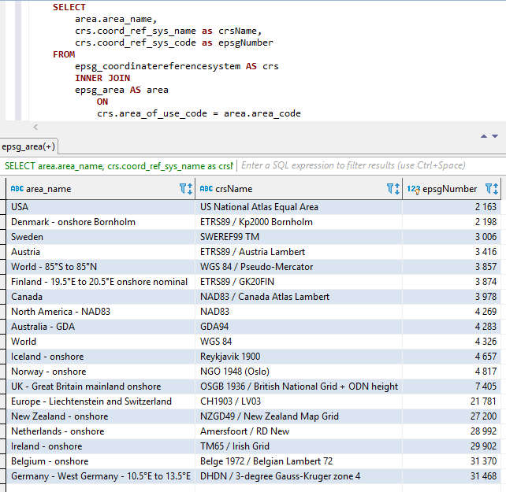
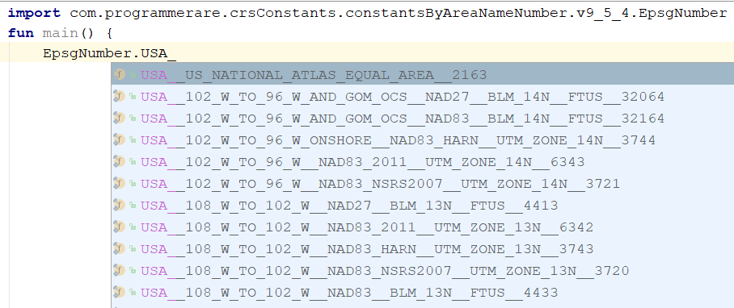
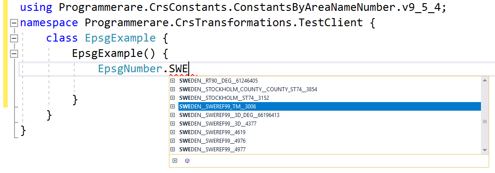

# License Notice
Notice that the "Core" library with the adapter API and general code is released with MIT License.  
However, the adapter implementations libraries are licensed in the same way as the adapted libraries which is specified in separate "LICENSE_NOTICE" files (in the adapter base directories) for each such implementation.

# Information about this Coordinate Reference System Transformations library
This F#/C#/.NET project is intended for transforming coordinates between different coordinate reference systems (CRS).  
The adapters are using third-part .NET libraries as adaptee's.  
The code has been implemented with F# but the tests (and the generated constants in the subproject "Programmerare.CrsTransformations.Constants") are implemented with C#.  
The .NET versions supported in the upcoming NuGet release: .NET 4.5 and .NET Standard 2.0  

# Usage
The methods for transforming coordinates are defined in the interface *ICrsTransformationAdapter*.  
There are currently seven classes implementing the interface. Three 'leafs' and four 'composites'.  
Each leaf adapter is using some adaptee library for the implementation.  
The four 'composites' are using the leafs like this:  
* **Median** (transforms using many leafs and use the *median* latitude/longitude result as the aggregated result)
* **Average** (transforms using many leafs and use the *average* latitude/longitude result as the aggregated result)
* **Weighted average** (transforms using many leafs and use the *weighted* average latitude/longitude result as the aggregated result)
* **First success** (iterates a list of leafs and tries to transform until some result seem to have succeeded)  
C#:
```C#
		using System.Collections.Generic; // IList
		using Programmerare.CrsTransformations; // ICrsTransformationAdapter
		using Programmerare.CrsTransformations.CompositeTransformations; // CrsTransformationAdapterCompositeFactory
		using Programmerare.CrsTransformations.Adapter.MightyLittleGeodesy;
		using Programmerare.CrsTransformations.Adapter.DotSpatial;
		using Programmerare.CrsTransformations.Adapter.ProjNet4GeoAPI;

		// ...

        // The interface with seven implementations as illustrated below
        ICrsTransformationAdapter crsTransformationAdapter; 
        // The interface is defined in the library "Programmerare.CrsTransformations.Core" with this full name:
        // Programmerare.CrsTransformations.ICrsTransformationAdapter
        
        // The three 'Leaf' implementations:

        // Library "Programmerare.CrsTransformations.Adapter.DotSpatial", class:
        // Programmerare.CrsTransformations.Adapter.DotSpatial.CrsTransformationAdapterDotSpatial
        crsTransformationAdapter = new CrsTransformationAdapterDotSpatial();

        // Library "Programmerare.CrsTransformations.Adapter.ProjNet4GeoAPI", class:
        // Programmerare.CrsTransformations.Adapter.ProjNet4GeoAPI.CrsTransformationAdapterProjNet4GeoAPI
        crsTransformationAdapter = new CrsTransformationAdapterProjNet4GeoAPI();

        // Library "Programmerare.CrsTransformations.Adapter.MightyLittleGeodesy", class:
        // Programmerare.CrsTransformations.Adapter.MightyLittleGeodesy.CrsTransformationAdapterMightyLittleGeodesy
        crsTransformationAdapter = new CrsTransformationAdapterMightyLittleGeodesy();

        // - - - - - - - - - - - -
        
        // The four 'Composite' implementations below are all located in the library
        // "Programmerare.CrsTransformations.Core" and the factory class is:
        // Programmerare.CrsTransformations.CompositeTransformations.CrsTransformationAdapterCompositeFactory
        var crsTransformationAdapterCompositeFactory = CrsTransformationAdapterCompositeFactory.Create();

        crsTransformationAdapter = crsTransformationAdapterCompositeFactory.CreateCrsTransformationMedian();
        
        crsTransformationAdapter = crsTransformationAdapterCompositeFactory.CreateCrsTransformationAverage();
        
        crsTransformationAdapter = crsTransformationAdapterCompositeFactory.CreateCrsTransformationFirstSuccess();
        // All of the above three factory methods without any parameter will try to use as many of the three (currently) 'leaf' 
        // implementations as are available in runtime (e.g. are included as NuGet dependencies).
        // If you want to specify explicitly which ones to be used, you can provide 
        // a parameter 'IList<ICrsTransformationAdapter>' to the Create method like this:
        crsTransformationAdapterCompositeFactory = CrsTransformationAdapterCompositeFactory.Create(new List<ICrsTransformationAdapter>{
            new CrsTransformationAdapterDotSpatial(),
            new CrsTransformationAdapterProjNet4GeoAPI(),
            new CrsTransformationAdapterMightyLittleGeodesy(),
        });
        
        // The fourth 'Composite' below does not use any implicit implementations  
        // but if you want to use a result created as a weighted average then the weights need 
        // to be specified explicitly per leaf implementation as in the example below.
        var weightFactory = CrsTransformationAdapterWeightFactory.Create();
        crsTransformationAdapter = crsTransformationAdapterCompositeFactory.CreateCrsTransformationWeightedAverage(new List<CrsTransformationAdapterWeight> {
            weightFactory.CreateFromInstance(new CrsTransformationAdapterDotSpatial(), 1.0),
            weightFactory.CreateFromInstance(new CrsTransformationAdapterProjNet4GeoAPI(), 1.0),
            weightFactory.CreateFromInstance(new CrsTransformationAdapterMightyLittleGeodesy(), 2.0),
        });
        // The weight values above illustrates a situation where you (for some reason) want to consider 
        // the transformation results from 'MightyLittleGeodesy' as being 'two times better' than the others.
```
All of the transform methods (defined in the above interface *ICrsTransformationAdapter*) need two parameters, one input coordinate and one parameter specifying the target system i.e. to which coordinate reference system the input coordinate will be transformed to.  

The target system can be specified with three data types (i.e. with overloaded methods), either an integer or a string, or a 'CrsIdentifier'.  
If an integer or string is used, then internally an 'CrsIdentifier' will be created, to send it as parameter to the adapter implementations.  
Therefore, if you intend to do many transformation from or to a coordinate reference system, then you may choose to create an instace of CrsIdentifier yourself, but for more convenience you may want to use the overloaded methods with integer as parameter (or maybe string if you already have acess to some "EPSG:"-string, see example below).

A coordinate includes information about the coordinate reference system, i.e. a 'CrsIdentifier' but there are also factory methods (creating coordinate instances) which are overloaded with integer or string parameters.  

There are many factory methods with different names and different order for the two (x/y) position values as illustated in the example below.  
Depending on the desired semantic in your context, you may want to use the different methods (or similarly named accessors in *CrsCoordinate*) like this:  
* X/Y for a geocentric or cartesian system
* Longitude/Latitude for a geodetic or geographic system
* Easting/Northing for a cartographic or projected system
* xEastingLongitude/yNorthingLatitude for general code handling different types of system
  
C#:
```C#
	using Programmerare.CrsTransformations.Identifier; // CrsIdentifier
	using Programmerare.CrsTransformations.Coordinate; // CrsCoordinate
	using static Programmerare.CrsTransformations.Coordinate.CrsCoordinateFactory;
	// The above row with "using static" enables many factory methods:
	// LatLon , LonLat , YX , XY , ... and so on (see the example code below)

	// ...

    int epsgNumber = 4326;
    string crsCode = "EPSG:" + epsgNumber;
    CrsIdentifier crsIdentifier; // namespace Programmerare.CrsTransformations.Identifier
    crsIdentifier = CrsIdentifierFactory.CreateFromEpsgNumber(epsgNumber);
    // Alternative:
    crsIdentifier = CrsIdentifierFactory.CreateFromCrsCode(crsCode);

    double latitude = 59.330231;
    double longitude = 18.059196;

    CrsCoordinate crsCoordinate; // namespace Programmerare.CrsTransformations.Coordinate
    // All the below methods are alternatives for creating the same coordinate 
    // with the above latitude/longitude and coordinate reference system.
    // No class or object is used for the methods below because of the following static import:
    // using static Programmerare.CrsTransformations.Coordinate.CrsCoordinateFactory;
    crsCoordinate = LatLon(latitude, longitude, epsgNumber);
    crsCoordinate = LatLon(latitude, longitude, crsCode);
    crsCoordinate = LatLon(latitude, longitude, crsIdentifier);
        
    crsCoordinate = LonLat(longitude, latitude, epsgNumber);
    crsCoordinate = LonLat(longitude, latitude, crsCode);
    crsCoordinate = LonLat(longitude, latitude, crsIdentifier);
        
    crsCoordinate = YX(latitude, longitude, epsgNumber);
    crsCoordinate = YX(latitude, longitude, crsCode);
    crsCoordinate = YX(latitude, longitude, crsIdentifier);
        
    crsCoordinate = XY(longitude, latitude, epsgNumber);
    crsCoordinate = XY(longitude, latitude, crsCode);
    crsCoordinate = XY(longitude, latitude, crsIdentifier);

    crsCoordinate = NorthingEasting(latitude, longitude, epsgNumber);
    crsCoordinate = NorthingEasting(latitude, longitude, crsCode);
    crsCoordinate = NorthingEasting(latitude, longitude, crsIdentifier);

    crsCoordinate = EastingNorthing(longitude, latitude, epsgNumber);
    crsCoordinate = EastingNorthing(longitude, latitude, crsCode);
    crsCoordinate = EastingNorthing(longitude, latitude, crsIdentifier);

    crsCoordinate = CreateFromYNorthingLatitudeAndXEastingLongitude(latitude, longitude, epsgNumber);
    crsCoordinate = CreateFromYNorthingLatitudeAndXEastingLongitude(latitude, longitude, crsCode);
    crsCoordinate = CreateFromYNorthingLatitudeAndXEastingLongitude(latitude, longitude, crsIdentifier);

    crsCoordinate = CreateFromXEastingLongitudeAndYNorthingLatitude(longitude, latitude, epsgNumber);
    crsCoordinate = CreateFromXEastingLongitudeAndYNorthingLatitude(longitude, latitude, crsCode);
    crsCoordinate = CreateFromXEastingLongitudeAndYNorthingLatitude(longitude, latitude, crsIdentifier);

    CrsIdentifier targetCrs = CrsIdentifierFactory.CreateFromEpsgNumber(3006);
    CrsTransformationResult crsTransformationResult = crsTransformationAdapter.Transform(crsCoordinate, targetCrs);
    // see more example code further down in this webpage
```

# Adaptee libraries used by the adapter libraries in the first release
* https://github.com/DotSpatial/DotSpatial
    (version 2.0.0-rc1)
* https://github.com/NetTopologySuite/ProjNet4GeoAPI
    (version 1.4.1)
* https://github.com/bjornsallarp/MightyLittleGeodesy
    (version 1.0.1)

# NuGet releases
The following five artifacts from this code project **will** become released/distributed to NuGet:
* Programmerare.CrsTransformations.**Core**
    (version 1.0.0)
* Programmerare.CrsTransformations.*Adapter*.**DotSpatial**
    (version 1.0.0)
* Programmerare.CrsTransformations.*Adapter*.**ProjNet4GeoAPI**
    (version 1.0.0)
* Programmerare.CrsTransformations.*Adapter*.**MightyLittleGeodesy**
    (version 1.0.0)
* Programmerare.CrsTransformations.*Constants*
    (version **9.5.4**)  

The three above libraries which includes "*Adapter*" in the name are adapter implementations of the above "*Core*" library.  
Those three adapters are using the three adaptee libraries for the coordinate transformations.  

The above '*MightyLittleGeodesy*' library is only useful for transformation between WGS84 (which is a very common global CRS) and the Swedish coordinate reference systems (CRS) SWEREF99 (13 versions e.g. "SWEREF99 TM") and RT90 (6 versions e.g. "RT90 2.5 gon V").   

The above library "Programmerare.CrsTransformations.*Constants*" is actually totally independent from the others.  
It is not depending on anything and nothing depends on it.  
It is a **C#** library (i.e. not even depending on F# like the others) with only one class with a lot of C# constants.  
(the other four Core/Adapter libraries are implemented with F#)    
The C# constant class has been generated from the [EPSG database](http://www.epsg-registry.org) version 9.5.4 which is the reason for the version number.

# NuGet configuration (when it has been released, though not quite yet)
The "Core" library is not necessary to include since there is an implicit/transitive dependency from all the "Adapter" libraries to the "Core".  
The "Constants" library is not needed but might be interesting if you want to use constants 
for the EPSG numbers rather than hardcoding them or define your own integer constants.  
```xml
<!-- Use one, two or three of the below Adapters -->
<PackageReference Include="Programmerare.CrsTransformations.Adapter.DotSpatial" Version="1.0.0" />
<PackageReference Include="Programmerare.CrsTransformations.Adapter.MightyLittleGeodesy" Version="1.0.0" />
<PackageReference Include="Programmerare.CrsTransformations.Adapter.ProjNet4GeoAPI" Version="1.0.0" />

<!-- The Core should not be necessary to include explicitly as below (since it should be implicitly included when using one of the others above ) -->
<PackageReference Include="Programmerare.CrsTransformations.Core" Version="1.0.0" />

<!-- Optional (and totally independent) library with only one class with lots of integer constants -->
<PackageReference Include="Programmerare.CrsTransformations.Constants" Version="9.5.4" />
```	

<!---
# TODO F# example
Below is a small F# example code working with the current version 1.0.0.  
The example code transforms a coordinate from a global CRS WGS84 (EPSG code 4326) latitude/longitude to
the Swedish CRS SWEREF99TM (EPSG code 3006).

SmallKotlinExample.kt
```kotlin
package smallKotlinExample

import com.programmerare.crsTransformations.compositeTransformations.CrsTransformationAdapterCompositeFactory.createCrsTransformationMedian
import com.programmerare.crsTransformations.coordinate.latLon

fun main(args: Array<String>) {
    val epsgWgs84 = 4326
    val epsgSweRef = 3006
    // alternative to the above hardcoding: use the library "crs-transformation-constants"
    // and constants EpsgNumber.WORLD__WGS_84__4326 and EpsgNumber.SWEDEN__SWEREF99_TM__3006
    // from the Java class com.programmerare.crsConstants.constantsByAreaNameNumber.v9_5_4.EpsgNumber

    val centralStockholmWgs84 = latLon(59.330231, 18.059196, epsgWgs84)

    val crsTransformationAdapter = createCrsTransformationMedian()
    // If the Gradle/Maven configuration includes all five adapter implementations, then the 
    // above created 'Composite' implementation will below use all five 'leaf' implementations 
    // and return a coordinate with a median longitude and a median latitude
    val centralStockholmResultSweRef = crsTransformationAdapter.transform(centralStockholmWgs84, epsgSweRef)
    if (centralStockholmResultSweRef.isSuccess) {
        println(centralStockholmResultSweRef.outputCoordinate)
        // Console output from the above code row: 
        // Coordinate(xEastingLongitude=674032.3573261796, yNorthingLatitude=6580821.991123579, crsIdentifier=CrsIdentifier(crsCode='EPSG:3006', isEpsgCode=true, epsgNumber=3006))
    }
}
```
---> 

# C# example
Below is a small C# example code working with the current version 1.0.0.  
The example code transforms a coordinate from a global CRS WGS84 (EPSG code 4326) latitude/longitude to
the Swedish CRS SWEREF99TM (EPSG code 3006).  
```C#
using Programmerare.CrsTransformations.Coordinate;
using Programmerare.CrsTransformations.CompositeTransformations;
using System; // Console

class SmallCSharpeExample {
    static void Main(string[] args) {
        int epsgWgs84  = 4326;
        int epsgSweRef = 3006;
        // alternative to the above two hardcodings: use the library "Programmerare.CrsTransformations.Constants"
        // and constants EpsgNumber.WORLD__WGS_84__4326 and EpsgNumber.SWEDEN__SWEREF99_TM__3006
        // from the class Programmerare.CrsConstants.ConstantsByAreaNameNumber.v9_5_4.EpsgNumber
         
        CrsCoordinate centralStockholmWgs84 = CrsCoordinateFactory.LatLon(59.330231, 18.059196, epsgWgs84);
        
        ICrsTransformationAdapter crsTransformationAdapter = CrsTransformationAdapterCompositeFactory.Create().CreateCrsTransformationMedian();
        // If the NuGet configuration includes all (currently three) adapter implementations, then the 
        // above created 'Composite' implementation will below use all three 'leaf' implementations 
        // and return a coordinate with a median longitude and a median latitude
        CrsTransformationResult centralStockholmResultSweRef = crsTransformationAdapter.Transform(centralStockholmWgs84, epsgSweRef);
        
        if(centralStockholmResultSweRef.IsSuccess) {
            Console.WriteLine(centralStockholmResultSweRef.OutputCoordinate);
            // Console output from the above code row: 
            // CrsCoordinate(xEastingLongitude=674032.357177155, yNorthingLatitude=6580821.99121561, crsIdentifier=CrsIdentifier(crsCode='EPSG:3006', isEpsgCode=True, epsgNumber=3006))
        }
    }
}
```

Another C# example with some more code and comments: 
```C#
using Programmerare.CrsConstants.ConstantsByAreaNameNumber.v9_5_4;
using Programmerare.CrsTransformations.CompositeTransformations;
using Programmerare.CrsTransformations.Coordinate;
using System;
using System.Collections.Generic;
...
    // Some terminology regarding the names used in the below code example:
    // "CRS" = Coordinate Reference System
    // "WGS84" is the most frequently used coordinate system (e.g. the coordinates usually used in a GPS)    
    // "SWEREF99TM" is the official coordinate system used by authorities in Sweden
    // "EPSG" = "European Petroleum Survey Group" was (but the EPSG name is still often used) 
    //           an organization defining CRS with integer numbers e.g.  4326 for WGS84 or 3006 for SWEREF99TM
    int epsgWgs84  = EpsgNumber.WORLD__WGS_84__4326;
    int epsgSweRef = EpsgNumber.SWEDEN__SWEREF99_TM__3006;
    // The above "EpsgNumber" class with LOTS OF constants (and more constants classes) have been generated, 
    // using "FreeMarker" and database downloaded from EPSG ( http://www.epsg.org or http://www.epsg-registry.org ) 
    // from "crs-transformation-code-generation" in the project https://github.com/TomasJohansson/crsTransformations

    CrsCoordinate centralStockholmWgs84 = CrsCoordinateFactory.LatLon(59.330231, 18.059196, epsgWgs84);
    // https://kartor.eniro.se/m/03Yxp
    // SWEREF99TM coordinates (for WGS84 59.330231, 18.059196) 
    // according to Eniro (above URL): 6580822, 674032 (northing, easting)
    
    ICrsTransformationAdapter crsTransformationAdapter; // interface with concrete "leaf" implementation or "composite" implementations
    // This code example is using a "composite" which will use multiple libraries to do the same transformation and then 
    // return a coordinate with the median values (median of the northing values and median of the easting values)  
    crsTransformationAdapter = CrsTransformationAdapterCompositeFactory.Create().CreateCrsTransformationMedian();
    // The above factory will try to use those known objects which implements the interface i.e. the number 
    // of "leaf" objects will depend on how many you included as for example NuGet dependencies (three in the above NuGet example)
    Console.WriteLine("Number of 'leafs' : " + crsTransformationAdapter.TransformationAdapterChildren.Count);
    // Console output from the above row:
    // Number of 'leafs' : 3

    // Transform the WGS84 coordinate to a SWEREF99TM coordinate:
    CrsCoordinate centralStockholmSweRef = crsTransformationAdapter.TransformToCoordinate(centralStockholmWgs84, epsgSweRef);
    Console.WriteLine("Median Composite Northing: " + centralStockholmSweRef.Northing);
    Console.WriteLine("Median Composite Easting: " + centralStockholmSweRef.Easting);
    // Console output from the above two rows:
    //      Median Composite Northing: 6580821.99121561
    //      Median Composite Easting: 674032.357177155
    // (and these can be compared with the 'Eniro' values above i.e. '6580822, 674032 (northing, easting)' )
    
    // The coordinate class provides four properties with different names for the same east-west value and 
    // four properties for the same name each north-south value, as below:
    //      Four EQUIVALENT properties:  Easting  , X , Longitude , XEastingLongitude
    //      Four EQUIVALENT properties:  Northing , Y , Latitude  , YNorthingLatitude
    // Regarding the above alternative methods, depending on the desired semantic in your context, you may want to use:
    //      X/Y for a geocentric or cartesian system
    //      Longitude/Latitude for a geodetic or geographic system
    //      Easting/Northing for a cartographic or projected system
    //      xEastingLongitude/yNorthingLatitude for general code handling different types of system
    
    // If you want more details for the result you can use the following 'Transform' method: 
    //  (instead of the method 'TransformToCoordinate' used above)
    CrsTransformationResult centralStockholmResultSweRef = crsTransformationAdapter.Transform(centralStockholmWgs84, epsgSweRef);
    if(!centralStockholmResultSweRef.IsSuccess) {
        Console.WriteLine("No coordinate result");
    }
    else {
        if(centralStockholmResultSweRef.IsReliable(
            2,      // minimumNumberOfSuccesfulResults
            0.01    // maxDeltaValueForXLongitudeAndYLatitude
        )) {
            // at least 2 succesful results and the maximal difference in northing or easting is less than 0.01
            // (and if you want to know the exact difference you can find it in this code example further down the page)
            Console.WriteLine("Reliable result"); // according to your chosen parameters to the method 'isReliable'    
        }
        else {
            Console.WriteLine("Not reliable result");
        }
        Console.WriteLine(centralStockholmResultSweRef.OutputCoordinate);
        // Console output from the above code row:
        // CrsCoordinate(xEastingLongitude=674032.357177155, yNorthingLatitude=6580821.99121561, crsIdentifier=CrsIdentifier(crsCode='EPSG:3006', isEpsgCode=True, epsgNumber=3006))
        
        // When your code is in a context where you only have the result (but not the adapter object) 
        // (e.g. in a method receiving the result as a parameter)
        // you can get back the object which created the result as below:
        ICrsTransformationAdapter crsTransformationAdapterResultSource = centralStockholmResultSweRef.CrsTransformationAdapterResultSource;
        CrsTransformationAdapteeType adapteeType = crsTransformationAdapterResultSource.AdapteeType;
        Console.WriteLine("adapteeType: " + adapteeType); // console output: COMPOSITE_MEDIAN
        // The above code row returned an enum which is not really a true adaptee just like the 'composite' is not a true adapter.
        // However, when iterating (as below) the "leaf" results, 
        // it might be more interesting to keep track of from where the different values originated
        IList<CrsTransformationResult> transformationResultChildren = centralStockholmResultSweRef.TransformationResultChildren;
        foreach (CrsTransformationResult crsTransformationResultLeaf in transformationResultChildren) {
            if(!crsTransformationResultLeaf.IsSuccess) continue; // continue with the next 'leaf'
            
            ICrsTransformationAdapter resultAdapter = crsTransformationResultLeaf.CrsTransformationAdapterResultSource;
            Console.WriteLine(resultAdapter.AdapteeType);
            // The above code row will output rows like this: 
            // "LEAF_PROJ_NET_4_GEO_API_1_4_1" or "LEAF_MIGHTY_LITTLE_GEODESY_1_0_1" and so on
            if(!crsTransformationResultLeaf.IsReliable(
                    2,      // minimumNumberOfSuccesfulResults
                    1000    // maxDeltaValueForXLongitudeAndYLatitude
            )) {
                // The above constraint "at least 2 implementations" will always fail because now we are dealing with "leafs"
                // The above delta value constraint has very high tolerance but it does not matter since 
                // the constraint about the number of implementations will fail
                Console.WriteLine("Only 'composites' can have more than one result and this is a 'leaf' and thus does not at least two results");
            }
            Console.WriteLine("Adapter long name: " + resultAdapter.LongNameOfImplementation); // full class name including package
            Console.WriteLine("Adapter short name: " + resultAdapter.ShortNameOfImplementation); // class name suffix i.e. the unique part
            // The above "long" names will be for example:
            //      Programmerare.CrsTransformations.Adapter.DotSpatial.CrsTransformationAdapterDotSpatial
            //      Programmerare.CrsTransformations.Adapter.MightyLittleGeodesy.CrsTransformationAdapterMightyLittleGeodesy
            // The above "short" names will be for example:
            //      DotSpatial
            //      MightyLittleGeodesy
            Console.WriteLine("adaptee: " + resultAdapter.AdapteeType);
            // The above row will output for example:
            //      LEAF_DOT_SPATIAL_2_0_0_RC1
            //      LEAF_MIGHTY_LITTLE_GEODESY_1_0_1
            // (note that the version number is included for the adaptees)
            Console.WriteLine("isComposite: " + resultAdapter.IsComposite); // "False" since we are iterating "leaf" results
            Console.WriteLine("Coordinate result for " + resultAdapter.AdapteeType + " : " + crsTransformationResultLeaf.OutputCoordinate);
            // The above row will output these rows when doing the iteration:
            //      Coordinate result for LEAF_DOT_SPATIAL_2_0_0_RC1 : CrsCoordinate(xEastingLongitude=674032.357322213, yNorthingLatitude=6580821.99121561, crsIdentifier=CrsIdentifier(crsCode='EPSG:3006', isEpsgCode=True, epsgNumber=3006))
            //      Coordinate result for LEAF_PROJ_NET_4_GEO_API_1_4_1 : CrsCoordinate(xEastingLongitude=674032.357177155, yNorthingLatitude=6580821.99437121, crsIdentifier=CrsIdentifier(crsCode='EPSG:3006', isEpsgCode=True, epsgNumber=3006))
            //      Coordinate result for LEAF_MIGHTY_LITTLE_GEODESY_1_0_1 : CrsCoordinate(xEastingLongitude=674032.357, yNorthingLatitude=6580821.991, crsIdentifier=CrsIdentifier(crsCode='EPSG:3006', isEpsgCode=True, epsgNumber=3006))
            // Note that the median value for "x" is 674032.357177155 for the above 
            // three values 674032.357 , 674032.357177155 , 674032.357322213 . 
            // That is the same value as was displayed before the iteration of the children/leafs for the median composite.
            // The same applies for the above "y" i.e. the median is 6580821.99121561
            // for the three y values 6580821.991 , 6580821.99121561 , 6580821.99437121
        }
        // The result object also provides convenience methods for the results (which you of course otherwise might calculate by iterating the above results)
        CrsTransformationResultStatistic crsTransformationResultStatistic = centralStockholmResultSweRef.CrsTransformationResultStatistic;
        // Note that the initially created composite was a "median composite" returning the median as the main value, 
        // but you can also create an average composite and regardless you can access both the median and the average with the aggregated statistics object:
        Console.WriteLine("average coordinate: " + crsTransformationResultStatistic.CoordinateAverage);
        Console.WriteLine("median coordinate: " + crsTransformationResultStatistic.CoordinateMedian);
        // Console output from the above two rows:
        // average coordinate: CrsCoordinate(xEastingLongitude=674032.357166456, yNorthingLatitude=6580821.99219561, crsIdentifier=CrsIdentifier(crsCode='EPSG:3006', isEpsgCode=True, epsgNumber=3006))
        // median coordinate: CrsCoordinate(xEastingLongitude=674032.357177155, yNorthingLatitude=6580821.99121561, crsIdentifier=CrsIdentifier(crsCode='EPSG:3006', isEpsgCode=True, epsgNumber=3006))

        Console.WriteLine("MaxDifferenceForXEastingLongitude: " + crsTransformationResultStatistic.MaxDifferenceForXEastingLongitude);
        Console.WriteLine("MaxDifferenceForYNorthingLatitude: " + crsTransformationResultStatistic.MaxDifferenceForYNorthingLatitude);
        // Output from the above two rows:
        // MaxDifferenceForXEastingLongitude: 0.000322213280014694
        // MaxDifferenceForYNorthingLatitude: 0.00337121076881886
        // As you can see in the above iteration, the min and max x values are 674032.357 and 674032.357322213 (and the difference is 0.000322213).
        // Similarly the min and max y values are 6580821.991 and 6580821.99437121 (and the difference is 0.00337121).
        // The above two "MaxDifference" methods are used within the implementation of the convenience method 'isReliable' 
        // (also illustrated in this example further above)
    }
```
# The library "Programmerare.CrsTransformations.Constants" with EPSG integer constants
The integer constants are generated by using the [EPSG database](http://www.epsg-registry.org)  
and the Java library FreeMarker in "crs-transformation-code-generation" in the project https://github.com/TomasJohansson/crsTransformations  
Each constant is used for defining a coordinate reference system (CRS).  
The name of a constant is a concatenation of the following three parts:
* Name of the area (e.g. country)
* Name of the CRS
* EPSG number (also the integer value for the constant)

SQL result example when selecting the above three columns:
  
The above three parts are concatenated (in the above order) with two underscores as separator between the parts.  
Spaces and other special characters are replaced with underscores.  
The names are also uppercased.  

Screenshots from Visual Studio 2017 when using intellisense/autocompletion with the class EpsgNumber:
  
  

Some examples of constant names in the C# class [Programmerare.CrsConstants.ConstantsByAreaNameNumber.v9_5_4.EpsgNumber](https://github.com/TomasJohansson/crsTransformations-dotnet/blob/master/Programmerare.CrsTransformations.Constants/Programmerare/CrsConstants/ConstantsByAreaNameNumber/v9_5_4/EpsgNumber.cs):
```C#
WORLD__WGS_84__4326  
WORLD__85_S_TO_85_N__WGS_84__PSEUDO_MERCATOR__3857  
NORTH_AMERICA__NAD83__NAD83__4269  
USA__US_NATIONAL_ATLAS_EQUAL_AREA__2163  
CANADA__NAD83__CANADA_ATLAS_LAMBERT__3978  
UK__GREAT_BRITAIN_MAINLAND_ONSHORE__OSGB_1936__BRITISH_NATIONAL_GRID__ODN_HEIGHT__7405  
IRELAND__ONSHORE__TM65__IRISH_GRID__29902  
AUSTRALIA__GDA__GDA94__4283  
NEW_ZEALAND__ONSHORE__NZGD49__NEW_ZEALAND_MAP_GRID__27200  
SWEDEN__SWEREF99_TM__3006  
FINLAND__19_5_E_TO_20_5_E_ONSHORE_NOMINAL__ETRS89__GK20FIN__3874  
DENMARK__ONSHORE_BORNHOLM__ETRS89__KP2000_BORNHOLM__2198  
NORWAY__ONSHORE__NGO_1948__OSLO__4817  
ICELAND__ONSHORE__REYKJAVIK_1900__4657  
NETHERLANDS__ONSHORE__AMERSFOORT__RD_NEW__28992  
BELGIUM__ONSHORE__BELGE_1972__BELGIAN_LAMBERT_72__31370  
GERMANY__WEST_GERMANY__10_5_E_TO_13_5_E__DHDN__3_DEGREE_GAUSS_KRUGER_ZONE_4__31468  
AUSTRIA__ETRS89__AUSTRIA_LAMBERT__3416          
EUROPE__LIECHTENSTEIN_AND_SWITZERLAND__CH1903__LV03__21781  
```
The above examples with constants are just showing a very few of them.  
The actual number of constants in the generated class is 6733.  
This number can easily be retrieved with the C# code 'typeof(EpsgNumber).GetFields().Length'.  
The same number can also be verified with the value returned by the SQL statement 'SELECT count(DISTINCT coord_ref_sys_code) FROM epsg_coordinatereferencesystem' (or simply 'SELECT count(*) FROM epsg_coordinatereferencesystem' since 'coord_ref_sys_code' is the primary key).
